# Introduction To Creating An Anatomy Ontology

This is an overview of the workflow we developed while building the Planarian Anatomy Ontology (PLANA). The goal of this presentation is to give you an idea of what skills you need to create an anatomy ontology of your own and to give you some guidlines and tips. Check out the manuscript about our anatomy ontology, PLANA  (https://www.biorxiv.org/content/10.1101/2020.08.14.251579v1).

Before you start, ask yourself, "Do you need an anatomy ontology?".  

!!!! Make sure there isn't one already. !!!!  

Does the community need a resource to bring all the vocabulary together? Is there an abundance of data that would do well if it was better organized with controlled anatomical concepts? If there isn't an anatomy ontology yet and you answered yes to any of these questions, then you do need an anatomy ontology. 


### 1. Identify publications to use for term collection.


__Overview:__

The very first step is to amass publications for the collection of terms for your new ontology. The manuscripts should contain anatomical terms that cover the majority of the terms you want to include in the new anatomy ontology.  This is an important method for reporting and reproducibility.

_PLANA Literature Google Sheet_
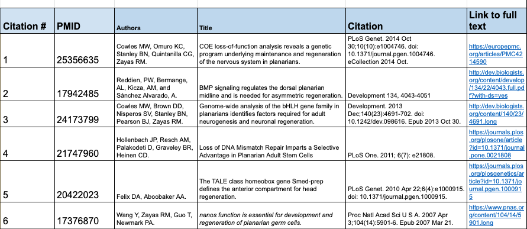

> We captured the publication unique identifier, such as the Pubmed id (PMID) or ISBN, and other fields we wanted to search by (author, title, and citation). Each record was assigned a similarly formatted unique record ID in the first column (i.e., 1,2,3,4..).


__How to:__   
* Specify search engine  
  * i.e., Pubmed   
* Select a starting and ending year with justifications  
  * i.e., 2005 - present,  2005=advent of RNAi  
* Record your search terms  
  *  i.e., *Schmidtea mediterranea*   
* Provide a list of exceptions  
  *  i.e., historical landmark publications: Hyman 1951  

__Software:__  
* Publication search engine  
  * for publication search  
* Google Sheets  
  * for recording and organizing publications  

__Required Skills:__  
Reading, spread sheet knowledge


### 2. Identify and record anatomical terms.

__Overview:__    

The goal is to be as complete as possible. This means that the ontology will contain terms the community wants to use, and it means it will contain the terms that the community has already used. Having as many people in the community use the ontology is important so this means inclusiveness is important. Don't reinvent the wheel, terms do not need to be invented.  

_Fig 1. Literature Term Collection Sheet_  
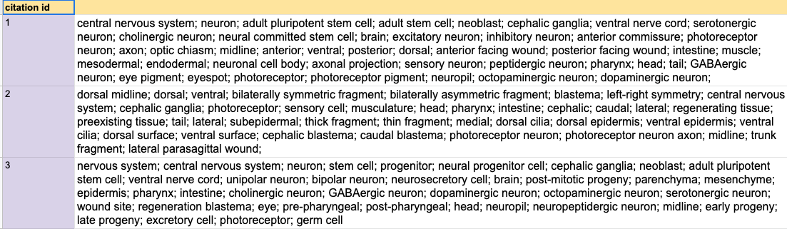

> column 1: the unique identifier for each citation from the literature list.   
> column 2: a semi-colon (;) separated list of every potential anatomical and developmental staging term in its **singular (not-plural)** form.  
>
> 

__How to:__  
Systematically read through each of the manuscripts found with the pre-designated search criteria (Step 1).   
* Record each anatomical term found in each publication.  
* Link to a citation  
* Use the **singular form** of each term identified  
* Make a note, if it is the first time a term is used.  
  * This makes future definition writing easier  
* Create a new class sheet that has one term per row with a citation column (fig 4, below).  

__Software:__  
   Option 1:  Google Sheets  
   Option 2:  Scripting language like perl or python.   

__Required Skills:__    
   Option 1: Google Sheets knowledge for recording terms and formula usage for text manipulation (i.e., text to columns, paste special transpose)  
   Option 2: Use or write a script to manipulate text.   

_Fig 2. Example Perl script for organizing data_    
```perl
#!/usr/bin/perl
use strict;
use warnings;

my $in_tsv = shift;
open TSV, $in_tsv or die "Can't open tsv:$in_tsv\n";

my %terms;
while (my $line = <TSV>){
  chomp $line;
  my ($citation_id,$terms) = split "\t", $line;
  my @terms = split /\s*;\s*/ , $terms;
  foreach my $term (@terms){
    $terms{$term}{$citation_id}++;
  }
}

foreach my $term (sort keys %terms){
  my @citations = sort {$a <=> $b} keys %{$terms{$term}};
  my $citations = join(",",@citations);
  print join("\t",$term,$citations),"\n";
}
```

> Perl script for reorganizing the term collection sheet (fig 1) into the sheet that can be used for all further organization.


_Fig 3. Output for term sorting perl script_
```text
%] perl getList.pl term_collection.tsv 
9+1 axonemal microtuble arrangement	203
9+2 arrangement of microtubules	124
9+2 cilia	114
A-P axis	64,82,175
A-tubule	22
A/P axis	101,127,128,167,197
AGAT-1 expressing cell	138,141
AGAT1 expressing cell	135
AP axis	96,126,167,169,176,198
AP gradient	144
...

%] perl getList.pl term_collection.tsv > ontology_class_management_sheet.tsv
```

> Output from the above perl script.
>
> column 1: term name
> column 2: list of all citation ids that mention the term


_Fig 4. Ontology class management sheet_  
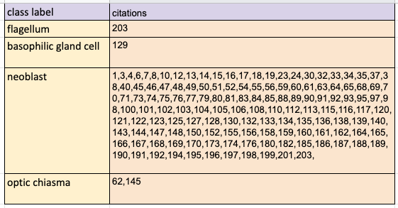

> Output from the perl script can be pasted into a google sheet. Use this sheet to build and further organize your ontology terms
>
> Column 1: term name  
> Column 2: list of all citation ids that mention the term  


### 3. Organize terms into conceptual groups.

__Overview:__

The goal is to identify groups of terms that have the same definition but different names (synonyms). An additional goal is to pinpoint terms that might not be great solo terms, or synonyms, but would be excellent to use in a definition.

_Fig 5. Updated Ontology class management sheet with conceptual groups_
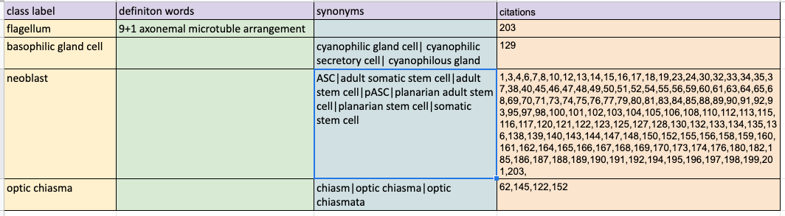

> Ontology class management sheet from fig 4 with conceptually grouped terms.  
>
> Column 1: best term (most popular, most "correct") for this concept  
> Column 2: collect terms that work better in a definition of another term than becoming its own class  
> Column 3: semi-colon separated list of all terms that work best as synonyms  
> Column 4: the combined list of citation IDs for the class label, synonyms, and definition terms.  


__How to:__

* Add columns to your ontology management sheets from Step 2:  
  * Synonyms (col 3 in fig 5)
  * Words to be used in the definition (col 2 in fig 5)
  * Not useful (include reason why)  
* Copy and paste terms into new columns (see fig 5)  

__Software:__  
   Google Sheets  

__Required Skills:__
   Reading, writing, drag and dropping, copy and pasting, organizing 
	


### 4. Organize terms into hierarchical groups

__Overview:__

The goal is to determine the overall structure and granularity of the ontology by grouping terms into larger categorical bins.

_Fig 6. Updated Ontology class management sheet with hierarchical groups_
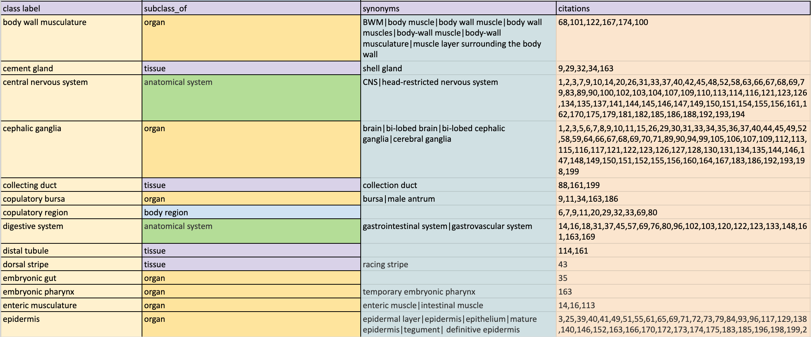

> Ontology class manage sheet that has added super classes.  
>
> column 1: class label  
> column 2: big bin, or the super class, for class, i.e., body region, organ, tissue  
>
> Col 3, 4  from fig 5.  


__How to:__

*  Group terms into 'big bins' or Super Classes. Add a single new column to your ontology class management sheet, 'subclass of'.  

Super classes:  
  * Body regions (head region)  
  * Systems (nervous system)  
  * Organs (cephalic ganglia)  
  * Tissues (optic chiasma)  
  * Cells (neuron) 
  * Cell parts (axon)  
  * Organelles (mitochondria)  
  * Spatial terms (midline, planes, etc)  
  * Developmental stages (juvenile, stage 2 embryo)  


__Software:__
   Google Sheets

__Required Skills:__
   Some understanding of your organism and its anatomical organization (which you might have learned more about when you read the manuscripts to record terms). 
	


### 5. Reuse classes from existing ontologies

__Overview:__

The goal is to start connecting your ontology to other ontologies. There is more strength in ontologies that are interoperable with other ontologies. This allows for reusing other's hard work with definitions, synonyms, and linking out to other databases (database cross references = DBXREF).


_Fig 7. Updated Ontology class management sheet with other ontology dbxrefs_
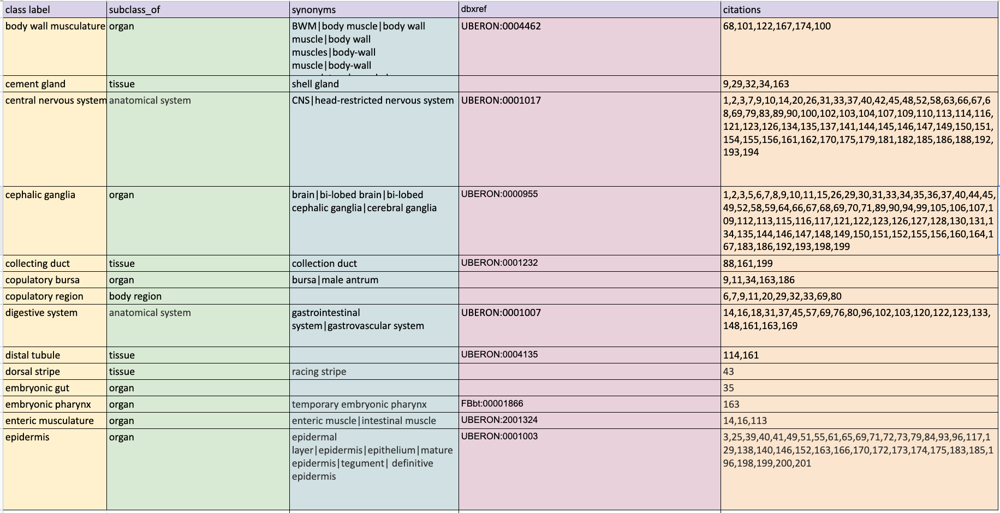

> Ontology class management sheet with a new column, dbxref.
> 
> column 4: other ontology IDs, database crossreferences, dbxref  


__How to:__

* Add a column for DBXREF to your ontology class management sheet.  
* Visit the EBI's Ontology Lookup Service (https://www.ebi.ac.uk/ols)  
* Start looking up the terms in the ontology class management sheet.  
* Examine the definitions and super classes for the terms to determine if they match the concepts of your term.  
* If the term is acceptable, record its ID in the new DBXREF column.  

__Tips__

Not all ontologies are made the same, not all ontologies are equally reputable. These are ones you should review first: 
* UBERON: Uber-anatomy ontology. For body systems, organs.  
* CL: Cell ontology. For cell types  
* Other closely related organism ontologies. Check out that they include definitions and how many dbxrefs they use. If they don't have definitions or dont use many dbxrefs, it might not be a good idea to use.  
* GO: Gene ontology. If your term is not found in UBERON, or CL, then visit GO.  

__Software:__
* Google Sheets  
* EBI's Ontology Lookup Service (https://www.ebi.ac.uk/ols)  

__Required Skills:__
   Reading  
	

_Fig 8. Ontology Lookup Service_

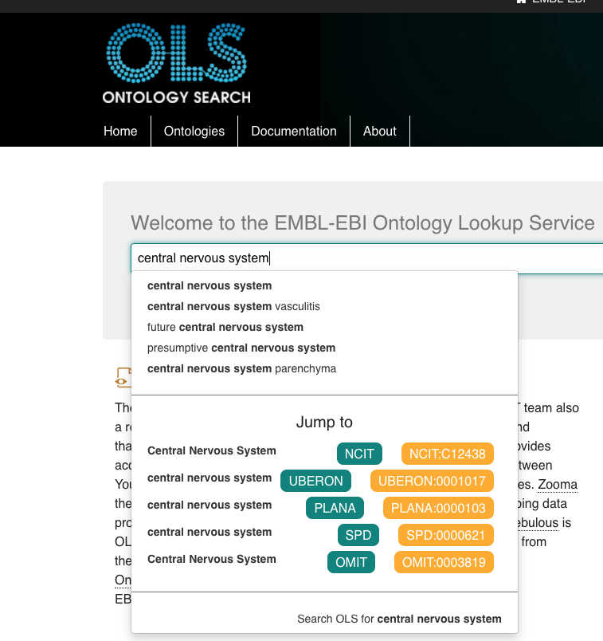

> Using OLS to search for 'central nervous system'


_Fig 9. Ontology Lookup Service_

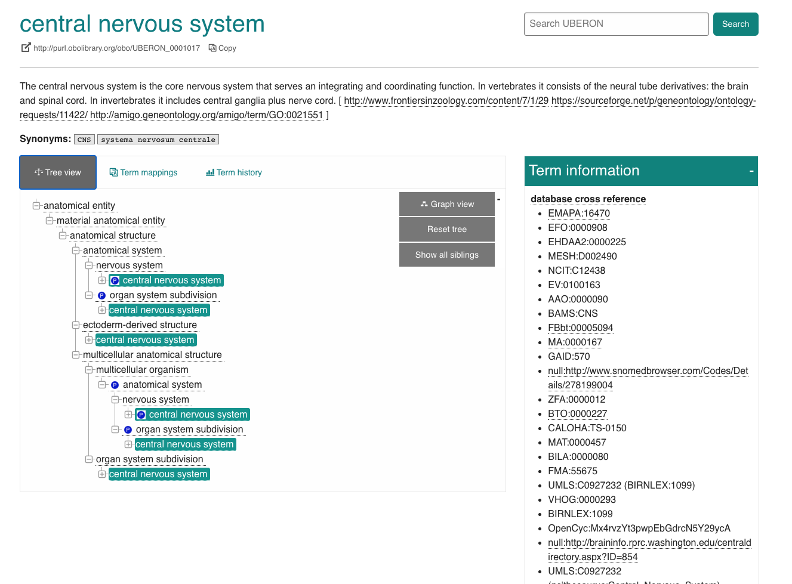

> Review the definitions, synonyms, and the hierarchy of terms. Do these all fit with your term? Reuse the term!!


### 6. Generate definitions

__Overview:__

The goal is to write a complete and descriptive definition for each class. These should come from the literature but can be expanded to be clearer. The concept of a class is that a class is a complete idea which is centered on its definition. The label and the synonyms should be able to be used interchangeably. This is made possible by well written definitions.

_Fig 10. Updated Ontology class management sheet with definitions_
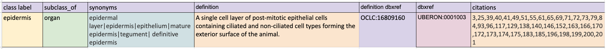

> Add more information to your class management sheet. Add in definitions and definition citations. The definition dbxref is an external database reference that is specifically a reference for the definition. A general dbxref are references to classes in other ontologies that are homologous. 
>
> column 4: definition  
> column 5: the definition citation  


__How to:__

* Create a definition and a definition dbxref column in the ontology class management sheet.  
* If this term was found in another ontology you can reuse the definition. Be sure to record the other ontology class ID in the definition dbxref column. 
* If this term is not found in another ontology. Look back through your Literature Term Collection Sheet (fig 1) to find your notes about first mention of a class. Retrieve these definitions from the publications for your classes. Record the definition and the PMID or other external ID in your defintion dbxref column.


__Software:__
  Google Sheets

__Required Skills:__
  Reading


### 7. Define discrete list of terms for relationships

__Overview:__

One of the biggest differences between controlled vocabulary and an ontology is that ontology classes can be related to each other. Using defined and consistent relationships is a cornerstone for interoperability, anatomy ontologies should be able to cross talk for comparative work. Most ontologies use relationship terms from the OBO Relations Ontology (RO). 

_Fig 11. Commonly used RO terms_  
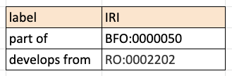


__How to:__

* Determine which relationships you are using from RO.  
* Determine usage rules like these common directional rules:  

YES:			 finger  **part-of**  hand  
 NO:			 hand **has-part** finger  

YES:			differentiated cell **develops-from** stem cell  
 NO:			stem cell **develops-into** differentiated cell   (not all stem cells develop into anything)  


> using 'has-part' and 'develops-into' makes relationship management more difficult. Imagine that every time you add a new term that you need to systematically determine every structure that 'has-part' this new term, edit each of these terms with a new 'has-part' relationship.  Using 'part-of' makes it so you only have to edit the single new term. Less chance of human error.

__Software:__
   OLS and a google sheet to record RO term of interest  

__Required Skills:__
   Reading, writing, reasoning


_Fig 12. OBO Relations Ontology Search at EBI OLS_
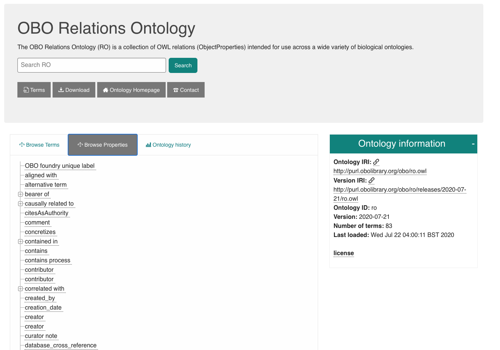

> Webinterface at EBI's OLS for Relationship ontology terms


### 8. Develop your framework. 


__Overview:__

The goal is to set up a standard framework for optimal interoperability and longterm ontology management. A standard framework includes the directory structure, the files, and the software you use to manage the ontology. The framework makes it possible to easily reuse terms and parts of other ontologies, check for errors, and manage ontology releases. Your framework should also help you to adhere to the Open Biomedical Ontology (OBO) [Principles](http://www.obofoundry.org/principles/fp-000-summary.html).


__How to:__


_Route 1:_

Manual route (No scripting required).   All pointing, clicking, draging to manage all terms one by one, with relationships, definitions, and annotation properties.

__Software:__  [Protégé](https://protege.stanford.edu/) (free)

**Skills:** learning new software

**Pro:** fairly easy to learn with tutorials and at the [available short course](https://protege.stanford.edu/short-courses.php), supportive community

**Possible Cons:** need to study the structure of other OBO ontologies to get your hierarchy correct, manage each term separately, one by one, lots of human time


_Fig 13. Protégé_
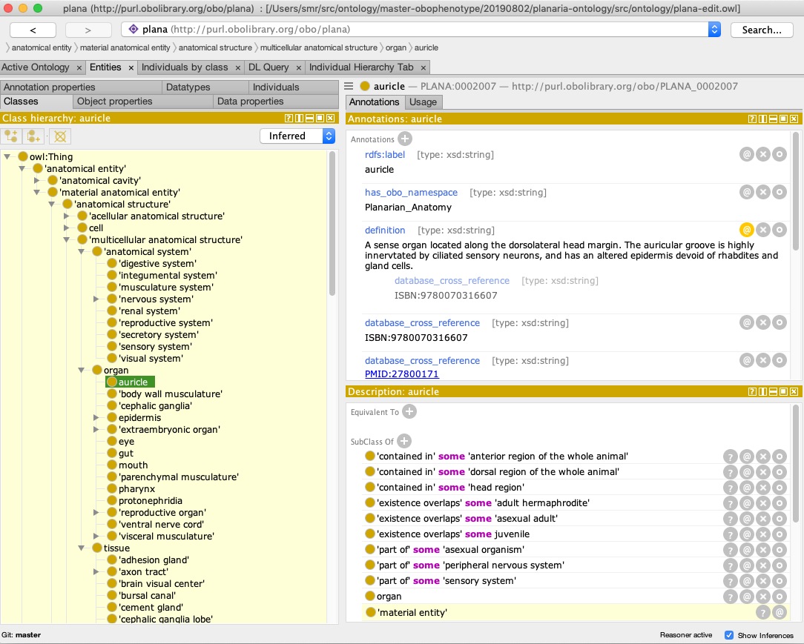

> View of the 'auricle' class. From the hierarchy you can see it is an 'organ'. It has a variety of annotation properties that you can see and edit in the 'Annotations' panel. How 'auricle' is related to other terms can be found in the 'Description' panel.


_Route 2: *Used by PLANA_  

More automated, scripts required, google sheet management of all terms, relationships, and definitions.

**Software:** 
* [Ontology-Development-kit (ODK)](https://github.com/INCATools/ontology-development-kit)
* [ROBOT](http://robot.obolibrary.org/)
* Google Sheets

**Skills:**

* Some scripting knowledge (Python, Perl, or other)  
* Read and writing yaml  
* Understanding [Dead Simple OWL Design Patterns (DOSDP)](https://github.com/INCATools/dead_simple_owl_design_patterns)   


**Pros:** continue to use google sheets, quicker, bulk management, easier to manage, amazing support community, instructions and manuals available. 

**Possible Cons:** need to use command line tools, use/write small scripts, and understand more file formats


_Fig 14. Command line management_  
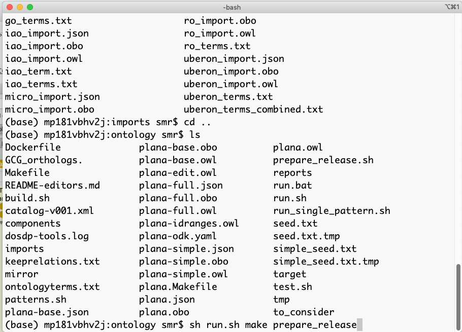


### 9. Create classes from terms

__Overview:__

The goal is to create your ontology classes from the terms in the ontology class management sheet and output as ontology web language (owl). Remember, a class is a concept that has a label and object properties. How you create your classes depends on your choice of route in the last step. 


__How to:__

_Route 1_

* Use Protégé to manually create every class in the correct format to maintain standards and to integrate with other ontologies.  
* OR ---> Run ODK to generate your template files, then open and edit in Protégé.  


**Software:**  Protégé [, and possiblily ODK]

**Skills:** Protégé skills [, linux command line knowledge] 


_Route 2: *Used by PLANA_

* Continue to add information into your google sheet.  
* Add a column for an ID for each class and populate (PLANA:0000012)  
* Create/Use DOSDP patterns for creating all your terms (Support is available).  
* Run included ODK scripts to generate appropriate files and import terms from other ontologies.  

   

**Software:**  ODK  

**Skills:** Protégé skills, linux command line knowledge   


### 10. Connect classes with relationships

**Overview:**

The goal is to give your ontology the power of reasoning. We want to connect terms like this:


'GABAergic neuron' **is_a** 'neurosecretory neuron'  


'neurosecretory neuron' **'part of' some** 'central nervous system'  
'neurosecretory neuron' **'part of' some** 'peripheral nervous system'  


'central nervous system' **is_a** 'nervous system'  
'peripheral nervous system' **is_a** 'nervous system'  


Now we can infer that 'GABAergic neuron' is <u>part of</u> the 'nervous system' (even though this is not explicitly stated)


**How to:**

_Route 1_

* Use Protégé to add annotation properties and relationships (SubClass Of).


_Fig 15. Protégé: Subclass Of_  
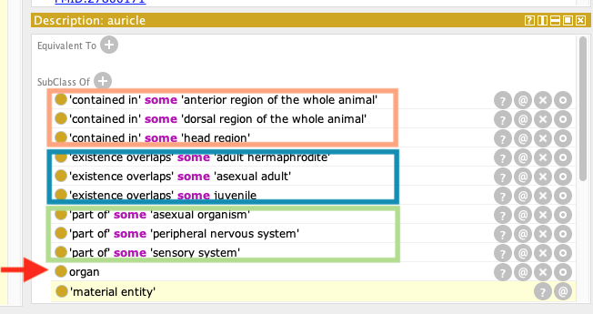


_Route 2:_

* Continue to use the ontology class management google sheet to add and edit information and to add relationships.
* Add a column for each relationship that is appropriate.
* Add class ID to the correct new columns.


_Fig 16. Ontology class management sheet with class relationships_
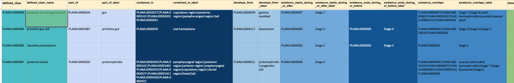

> Two columns for each relationship property, i.e., posterior primary gut branch 'part_of'  'PLANA:0000026' 'gut'


### 11. Testing the logic

**Overview:**

The goal is to make sure that the ontology makes biological sense.

A standard OBO ontology reasoner (ELK) is used to determine if the relations you explicitly stated between your classes result in correct inferred relationships. We had an issue when we tested for returning all items asserted and inferred that are part of the asexual animal. We saw we had the 'testis nerve plexus' part of the 'asexual animal'. Obviously to us, we saw right away that this was incorrect. We used this incorrect inference to track down the issue.


**How to:**

* Use Protégé, the Protégé ELK reasoner, and Protégé DL-Query plugin to formulate and run queries.
* Correct any inconsistencies
* Run more queries

_Fig 17. Protégé DL Query Plugin and example query and reasoned results_

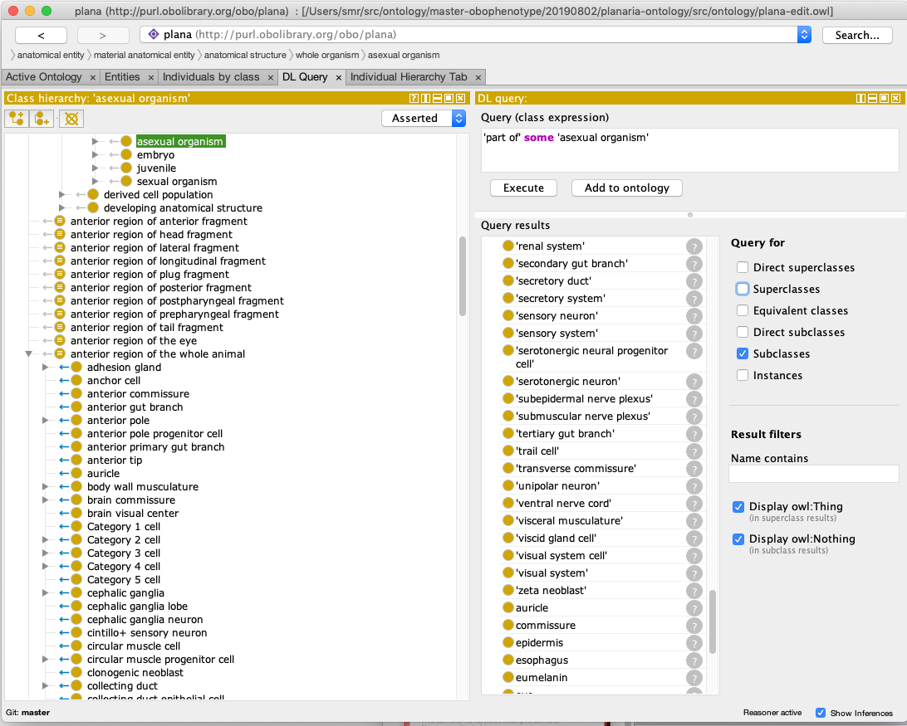


### 12. Release it!

**Overview:**

The goal is to have official versioned releases. This is important for users that import your ontology into their own ontologies and tools so that they can keep current.


**How to:**

* Create a GitHub release. There are tutorials for this, and information can be found in the ODK REAMDE documentation. 


### 13. Keep it updated


**Overview:**

An ontology is a living document. New terms will be needed to be added, terms will need to be modified, terms will need to be made obsolete.


**How to:**

* Keep modifying your spread sheet and running ODK scripts to update your owl files.  
* Make a new release.  
* Make a plan on how to handle community involvement for addition, modifying, and retiring of terms.   


